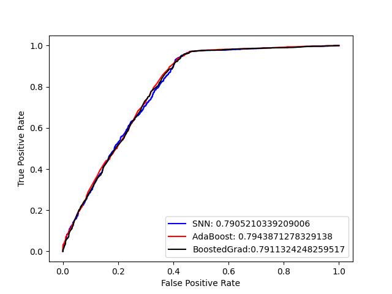

# Kaggle Project: Metastatic Cancer Diagnosis

This repository holds an attempt to train a model that can predict the chance of a patient recieving a successful cancer diagnosis within 90 days from the "Metastatic Cancer Diagnosis" Kaggle challenge: [Kaggle Challenge Details](https://www.kaggle.com/competitions/widsdatathon2024-challenge1/overview). 

## Overview
   The task for this Kaggle challenge was to use the provided dataset, which described general patient information, to train a model that could whether or not the patient recieved a metastaic cancer diagnosis within 90 days of screening. 
   The approach in this repository formulates the problem as binary classification task. Numerous models were trained, optimized, and tested for comparison, including a simple neural network, an AdaBoost ensemble using a tree classifier as an estimator, and a boosted gradient ensemble. These models were trained using features describing the patients' locations, ages, and cancer diagnosis codes and descisions. 
   My best model was able to obtain about 80% accuracy on the validation set, and recieved private and public scores from Kaggle of 0.789 and 0.798, respectively, for the provided test set. 

## Summary of Workdone

### Data

* Data:
  * Type:
    * Input: CSV file of features; text and numerical data describing patient information, such as state, age, cancer diagnosis codes, etc.
    * Output: success/failure; whether or not the patient recieved a metastatic cancer diagnosis within 90 days of screening.
  * Size: 12,906 observations/rows; 83 features/columns
  * Instances (Train, Validation, Test; Split): 6000 points for training, 3500 points for validation, 3406 poits for testing

#### Preprocessing / Clean up

* Filtered out unneccessary features, keeping only 'DiagPeriodL90D', 'patient_state', 'patient_age', 'metastatic_cancer_diagnosis_code', 'breast_cancer_diagnosis_code', 'breast_cancer_diagnosis_desc', and 'patient_zip3'
* Only 'patient_state' contained null values, which were replaced with the mode ('CA').
* The categorical features were encoded using OneHotEncoder(). 

#### Data Visualization

* This grid compares the success/failure for the metastatic cancer diagnosis within 90 days for each feature.
  * From this grid, it appears that 'metastatic_cancer_diagnosis_code', 'breast_cancer_diagnosis_code', 'breast_cancer_diagnosis_desc' are the best features for separating success from failure for the target feature. 

### Problem Formulation

* Define:
  * Input: selected features mentioned above.
  * Output: probability of either a 1 or 0 to represent success/failure for a metastatic cancer diagnosis within 90 days of screening.
  * Models:
    * Simple Neural Network; this model was selected for its power as a classifier.
    * AdaBoost ensemble using a tree classifier as an estimator; this model was selected based on another Kaggle participant, 'pax2m', who found success the model. It also served as a basis for understanding sklearn ensemble algorithms.
    * Boosted Gradient ensemble: this was selected after observing success using the AdaBoost ensemble to further explore the potential of ensembles.
  * Optimizer: The AdaBoost and Boosted Gradient ensembles were optimized using sklearn's GridSearchCV function.

### Training

* Description the training:
  * Training was done through sklearn and Jupyter Notebook on a laptop.
  * Training each model individually took only a few seconds. Optimizing via GridSearchCV took 2-3 minutes at most. 
  * I concluded training when I obtained results that could not be surpassed by simply changing parameters, selecting new features, or changing the size of the training subsets.
  * The greatest challenge was handling the categorical features of interest. OneHotEncoder() encoded the three subsets of the training set and the the testing dataset differently. I had to combine the four sets together to use OneHotEncoder before separating them again. I was also able to make my own encoder, which worked to great effect. 

### Performance Comparison

* Three different performance metrics were used for comparison:
  * The accuracy_score() function from sklearn.metrics, which compares the known answers with the model's predictions via model.predict().
  * The roc_auc_score() function from sklearn.metrics, which compares the known answers with the model's predicted probabilities from model.predict_proba()
  * The test dataset, which was submitted to kaggle, was graded by Kaggle. 
* Performance Comparison:
  | Model | Subset | Accuracy Score | ROC AUC Score |
  |---|---|---|---|
  | SNN | Train | 0.811 | 0.811 |
  | SNN | Vaidation | 0.813 | 0.794 |
  | SNN | Test | 0.810 | 0.791 |
  | AdaBoost | Train | 0.811 | 0.817 |
  | AdaBoost | Valdiation | 0.813 | 0.797 |
  | AdaBoost | Test | 0.811 | 0.794 |
  | Boosted Grad. | Train | 0.813 | 0.823 |
  | Boosted Grad. | Validation | 0.813 | 0.802 |
  | Boosted Grad. | Test | 0.810 | 0.791 |
* ROC Curve Comparison:  

### Conclusions

* It can be concluded that, while the three models performed similiarly, that the boosted gradient worked best, followed by the AdaBoost ensemble and simple neural network.

### Future Work

* The next thing I would try is exploring other sklearn functions that can clean/manipulate the dataset; this includes
  * Other encoders
  * Model selectors and cross validation
* Future studies could further research the features used for the model to confirm which features tend to have the highest correlation with the occurance of cancer and the success of screening. 

## How to reproduce results

* To fully reproduce my results:
   * Download the dataset from Kaggle.
   * Ensure the necessary libraries are installed.
   * Download and run the Kaggle_Project notebook attached in the directory.
* Useful Resources:
  * Sklearn website; the sklearn website is a great place to find detailed explainations of the models and tools used in this project.

### Overview of files in repository

* Directory Structure: the directory contains this README.md and the code for my Kaggle project
* Relevent Files:
  * Kaggle_Project.ipynb: this notebook contains all of the code for the final submission of my Kaggle project. 

### Software Setup
* Required Packages:
  * Numpy
  * Pandas
  * Sklearn
* Installation Process:
  * All packages were installed via the Linux subsystem for Windows.
  * pip3 install numpy
  * pip3 install pandas
  * pip3 install -U scikit-learn

### Data

* The data can be downloaded here: [Challenge Data](https://www.kaggle.com/competitions/widsdatathon2024-challenge1/data)
* Click "Download All" at the bottom of the page.

### Training

* These models can be trained by running the Kaggle_Project notebook in the repository.
* You can also refer to the official sklearn website to find the required parameters for each model.
* Sklearn website: [scikit-learn.org](https://scikit-learn.org/stable/)

#### Performance Evaluation

* The performace evaluation can be done by running the Kaggle_Project notebook in the repository.
* The training section for each model is immediately followed by performance evaluation.

## Citations

* References:
  * pax2m soluton; used as a basis for understanding sklearn ensemble and gridsearch functions: [pax2m submission](https://www.kaggle.com/competitions/widsdatathon2024-challenge1/discussion/483037)
  * Sklearn website; used for understanding the models and their parameters: [scikit-learn.org](https://scikit-learn.org/stable/)

